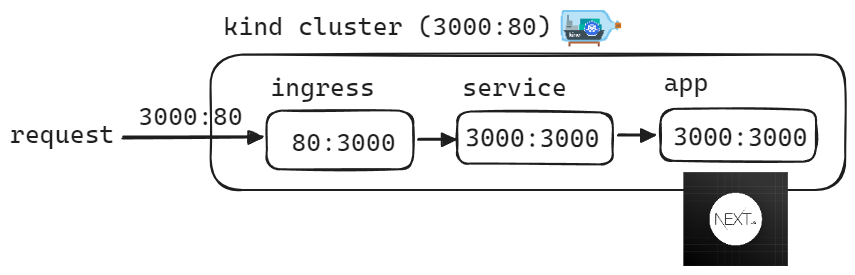

## 실습환경

이 예제는 로컬 쿠버네티스 클러스터인 [kind](https://kind.sigs.k8s.io/) 를 기반으로 합니다.

kubectl 을 통해 클러스터에 명령을 내리려면 로컬 환경에 클러스터가 있어야 하겠죠?

클러스터는 아래와 같이 생성합니다.

```bash
$ kind create cluster --name kustomize-sample-cluster --config=kustomize-sample-cluster.yml
```

<br>


위의 명령어에서 사용하는 kustomize-sample-cluster.yml 파일의 내용은 아래와 같습니다.

```yaml
kind: Cluster
apiVersion: kind.x-k8s.io/v1alpha4
nodes:
- role: control-plane
  kubeadmConfigPatches:
  - |
    kind: InitConfiguration
    nodeRegistration:
      kubeletExtraArgs:
        node-labels: "ingress-ready=true"
  extraPortMappings:
  # - containerPort: 80
  #   hostPort: 80
  #   protocol: TCP
  # - containerPort: 443
  #   hostPort: 443
  #   protocol: TCP
  - containerPort: 80
    hostPort: 3000
    protocol: TCP
# - role: worker
# - role: worker
# - role: worker
```

3000 포트를 사용하며, worker 노드 없이 master node 하나가 클러스터 역할을 수행하는 단순한 클러스터입니다.<br>

<br>


여기까지 설치를 했다면, kind 클러스터 내에서 ingress 를 사용하기 위해 kind 클러스터에 nginx-ingress 라고 하는 ingress controller 를 설치해줍니다.<br>

```bash
## ingrses-nginx 설치
$ kubectl apply -f https://raw.githubusercontent.com/kubernetes/ingress-nginx/main/deploy/static/provider/kind/deploy.yaml

## ingress-nginx 의 모든 pod 들이 로드 될때까지 90 초의 타임아웃을 두고 대기
$ kubectl wait --namespace ingress-nginx \
  --for=condition=ready pod \
  --selector=app.kubernetes.io/component=controller \
  --timeout=90s
  
## 여유 시간 20초 대기
## deployment 가 제대로 로드 될 때까지 20초 대기
$ sleep 20
```

<br>


지금까지의 트래픽의 흐름을 그림으로 그려보면 아래와 같습니다.<br>




<br>


위의 모든 과정은 `create-cluster.sh` 라고 하는 파일에 모두 정의해두었기에 아래의 명령을 수행합니다.

```bash
$ source create-cluster.sh
```

